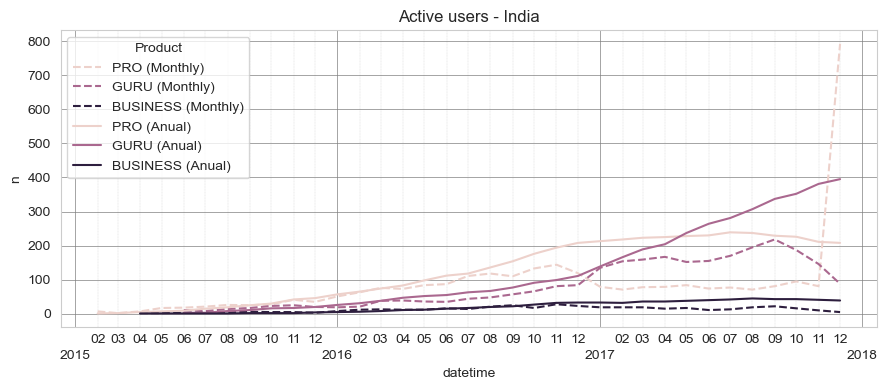

# Project structure
```
src/
│
├── config/
│   └── .env
│
├── loader.py
├── model.py
├── plot.py
└── processing.py

results/
│
├── forecast.csv
└── executuve_summary.pdf

data/
└── synthetical_payments.csv

docs/
│
└──Data Scientist test task.pdf

notebook_model.ipynb
notebook_data_exploration.ipynb
env.yml
```
## Explanation
### Configuration:
- `confg/.env` specifies in which folder the .csv file is located
### Code:
- `loader.py` loads and cleans the csv file
- `model.py` contains the necessary functions to make predictions
- `plot.py` contains re-used plots to ease readability
- `processing.py` contains functions to transform data
### Results
- `results` contains two files:
    - `forescast.csv` with the tasked forecast
    - `executive_summary.pdf` a one page summary of the analisys and forecast

<br>

`notebook_model.ipynb` the notebook containing the key insights and the results of the forecast

`notebook_data_exploration.ipynb` a notebook with a lot of EDA and analysis done, mainly descriptive
<br>

## To run the notebook and project
### Clone project
```
git clone https://github.com/victorguizien/semrush_vgm.git
```
### You will need an anaconda environment with using the provided env.yml file:
```
conda env create --name XXXXXXXXXXXXXXXX --file=env.yml
```

### After activating the environment you should also export the env to jupyter:
```
python -m ipykernel install --user --name=XXXX
```

### Afterwards you can simply open a jupyter notebook
```
jupyter notebook
```

<br>

# Main steps taken for the project development
## 1. Data Exploration
There was a lot of Data Exploration at first which didn't come into fruition as it only gave descriptive analysis, but that enabled me to streamline the cleaning process of the data and define the `load_and_clean()` function for example, and much more.

There is a lot covered on the notebook `data_exploration` which I didn't seem as the most relevant for the task at hand, or at least not analysed with enough time and caution.

## 2. Analysis & Key Points
- The main challenge for me was to accurately calculate the different metrics making sure to understand the difference between transactions and active users, and correctly summing / counting in each cases.

- In this part of the task I got a better understanding at how the products evolved throughout the years, and got the intuition behind what we could expect from the forecasting.

- As explained in the notebook (victor_guizien_martin_semrush_test), the main issue we can foresee is the deep dive in transactions both anual and monthly in GURU products which could lead to a significant drop in MRR in the next months.

- This change in transactions (and thus active subscriptions) is very rapid, while the MRR has certain inertia from the anual subscribers. This means it is not directly impacted, making it harder for the models to capture this changes.

    _(An alternative approach could be to try and forecast the number of monthly and anual users for each product and multiply by the price)_


## 3. Other comments
- I considered substituing the last month of India's data (PRO Monthly) with some MA or similar, due to the **very** unsual spike in subs, but who knows? 

    Maybe there was some crazy targeted marketing campaign and it ended up paying off big time.
    

#### There are a lot of unanswered questions such as:
- Do users that un-sub pay more that the price that is current?
- Users that un-sub: why? Is there a common factor to them? Is it only that they pay for month, crunch over-time for that month and get all the necessary analytics done?

#### And half-explored ideas such as:
-  I know some users signed-up with discounts, as the amount paid was lower than the price. This could be an interesting point to dive into and see if, on average, users last more when subbed with discout.

## 4. Future work
On top of everything mentioned above, it goes without saying that more data always benefits the model. 

More external variables such as marketing campaigns, the cost of capturing a client or even how did the user subbed all would probably help understand users better and thus help with the prediction of MRR.

I would also fine-tune the models a bit more, as they are probably full of flaws as they are (either by not capturing some seasonality or over-fitting for example)